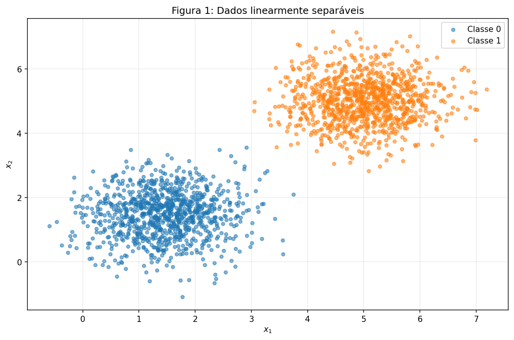
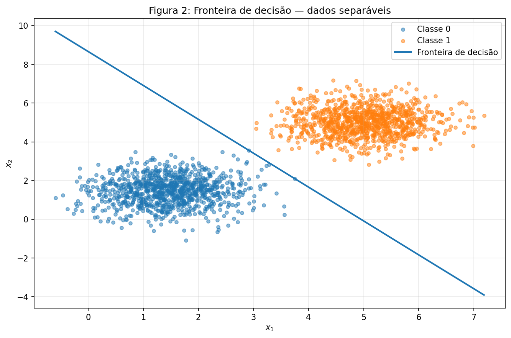
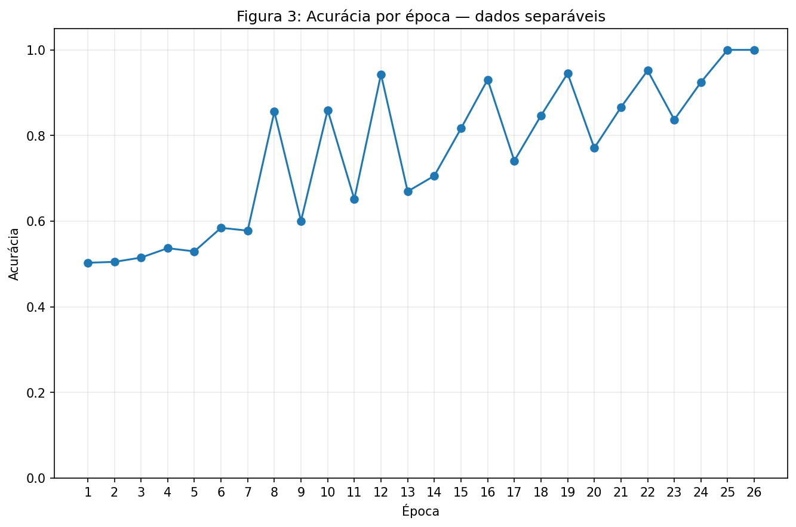
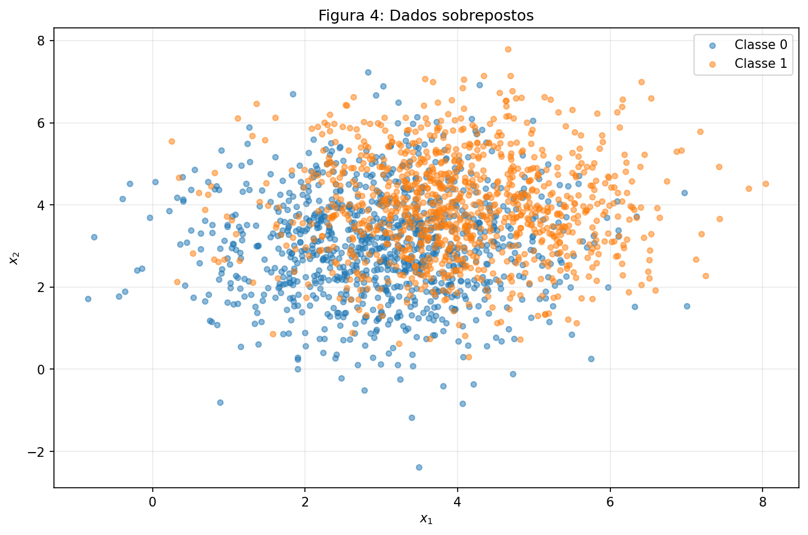
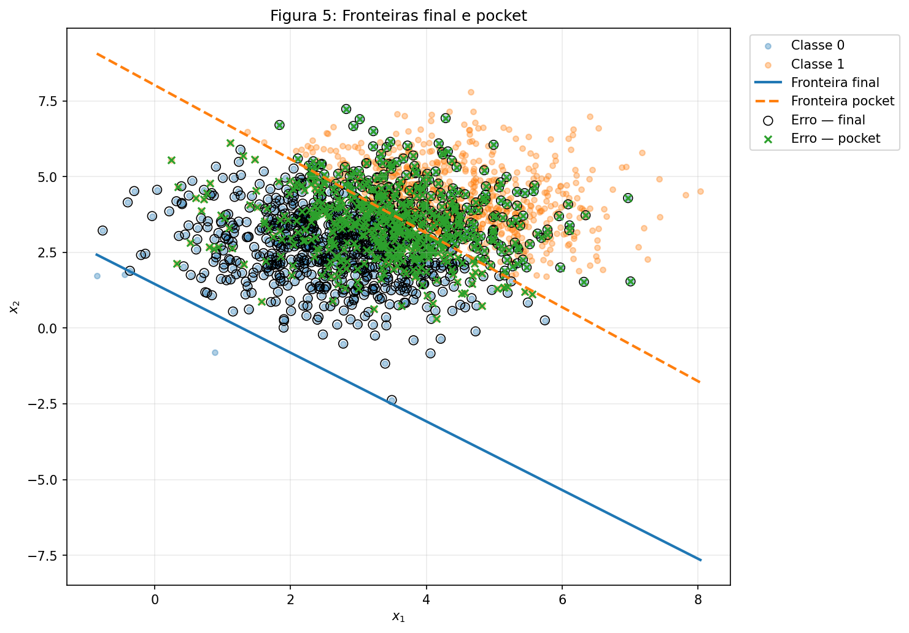
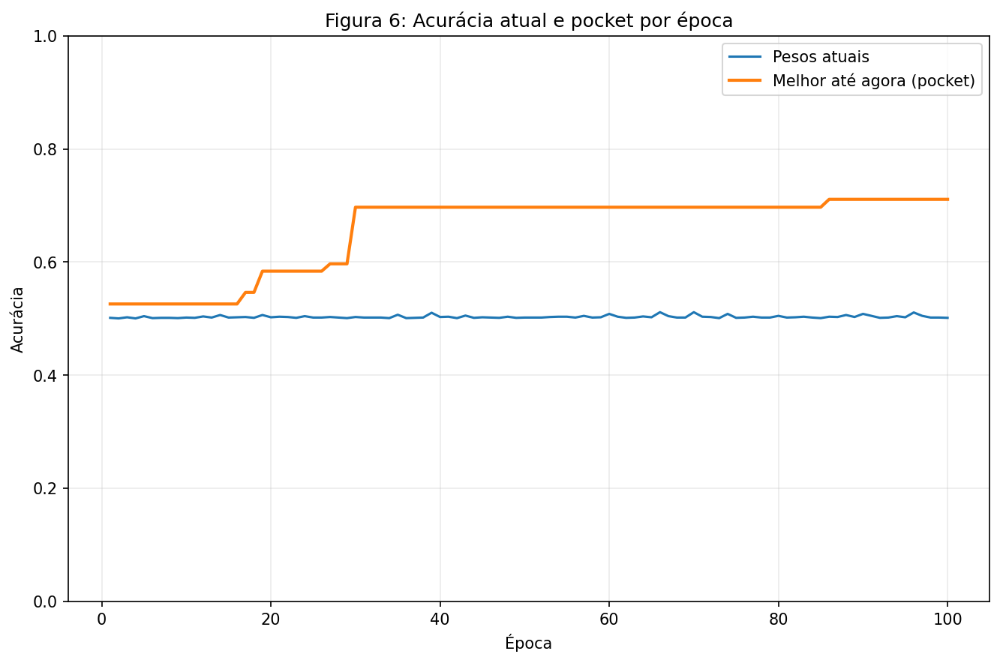

## Exercício 1

### A
A abordagem para este item envolveu a geração de duas classes de pontos 2D, com **1000 amostras por classe**, usando distribuições normais multivariadas. A Classe 0 foi gerada com média $[1.5, 1.5]$ e a Classe 1 com média $[5.0, 5.0]$, ambas com matriz de covariância $[[0.5, 0], [0, 0.5]]$.
A Figura 1 mostra duas nuvens bem separadas. Visualmente já existe uma faixa vazia entre as classes na qual uma reta pode ser posicionada, o que é exatamente o tipo de problema que um perceptron de camada única consegue resolver.



```python
--8<-- "docs/exercises/perceptron/code/ex1a.py"
```

### B
O perceptron foi implementado do zero. A predição utiliza a função degrau, retornando 1 quando $\mathbf{w}\cdot\mathbf{x}+b \geq 0$ e 0 caso contrário. Durante o treinamento, o erro é calculado por $y-\hat{y}$ e os parâmetros são atualizados somente quando ocorre uma classificação incorreta:

$$
\mathbf{w} \leftarrow \mathbf{w} + \eta(y-\hat{y})\mathbf{x}
$$

$$
b \leftarrow b + \eta(y-\hat{y}).
$$

O treinamento registra a acurácia e o número de atualizações após cada época. A condição de parada ocorre quando uma passagem completa pelo dataset não produz nenhuma atualização ou quando o limite de 100 épocas é atingido. A mesma implementação também permite guardar os melhores pesos encontrados durante o treino, recurso utilizado no Exercício 2.

```python
--8<-- "docs/exercises/perceptron/code/ex1b.py"
```

### C
Para $\eta=0.01$, os pesos foram inicializados com `rng.normal(0, 0.01, size=2)` e o bias inicial foi 0. A execução produziu:

* Pesos iniciais: $[0.00253205,\ 0.00895218]$.
* Pesos finais: $\mathbf{w}=[0.05049707,\ 0.02887168]$.
* Bias final: $b=-0.25$.
* Número de épocas até convergir: **26**.
* Acurácia final: **100.00%**.
* Pontos mal classificados ao final: **0**.



A Figura 2 apresenta a fronteira de decisão encontrada pelo perceptron sobre os dados separáveis. Como a acurácia final foi de 100%, nenhum ponto permaneceu mal classificado.



A Figura 3 mostra a acurácia obtida após cada época durante o treinamento.

```python
--8<-- "docs/exercises/perceptron/code/ex1c.py"
```

### D

1. **Por que dados separáveis convergem rápido?** A regra de atualização só altera os parâmetros quando há erro:

    $$
    \Delta\mathbf{w}=\eta(y-\hat y)\mathbf{x},
    \qquad
    \Delta b=\eta(y-\hat y).
    $$

    Nos dados separáveis existe pelo menos uma reta capaz de classificar todas as amostras corretamente. No começo do treino existem vários erros e, portanto, várias atualizações. Cada correção desloca a fronteira de decisão. Conforme a fronteira entra na região que separa as nuvens, menos pontos ficam do lado errado e o número de atualizações por época diminui até chegar a zero. Nesta execução, as atualizações por época foram $[3,3,4,4,3,4,3,4,2,4,2,4,2,3,3,3,2,3,3,2,3,3,2,3,1,0]$. Quando uma passagem inteira produz zero atualizações, todas as amostras estão corretamente classificadas e o treinamento para.

2. **Efeito de aumentar a taxa de aprendizado para $\eta=1.0$:** A segunda execução utilizou os mesmos dados, a mesma ordem, os mesmos pesos iniciais e o mesmo bias inicial. A única alteração foi a taxa de aprendizado. Com $\eta=0.01$, o treinamento convergiu em **26 épocas**, com **100.00%** de acurácia, $\mathbf{w}=[0.05049707,\ 0.02887168]$ e direção normalizada $\mathbf{w}/\|\mathbf{w}\|=[0.86812305,\ 0.49634905]$. Com $\eta=1.0$, convergiu em **37 épocas**, também com **100.00%** de acurácia, $\mathbf{w}=[5.87061596,\ 3.35923930]$ e direção normalizada $[0.86794992,\ 0.49665172]$.

    Quando $\eta=0.01$, cada correção tem escala da ordem de $0.01\mathbf{x}$, comparável aos pesos iniciais, que também possuem magnitude da ordem de 0.01. Assim, a inicialização ainda influencia a direção final. Com $\eta=1.0$, as correções são cerca de 100 vezes maiores e rapidamente dominam a contribuição de $\mathbf{w}_0$. Portanto, $\eta$ controla o tamanho de cada deslocamento da fronteira e, com inicialização não nula, pode levar o algoritmo a uma direção final diferente, mesmo quando as duas soluções classificam todos os pontos corretamente.

3. **O que aconteceria partindo de $\mathbf{w}_0=0$ e $b_0=0$?** Considere duas execuções com taxas $\eta_1$ e $\eta_2$. Depois de uma sequência de atualizações:

    $$
    \mathbf{w}^{(1)}=\eta_1\sum_t e_t\mathbf{x}_t,
    \qquad
    b^{(1)}=\eta_1\sum_t e_t
    $$

    e

    $$
    \mathbf{w}^{(2)}=\eta_2\sum_t e_t\mathbf{x}_t,
    \qquad
    b^{(2)}=\eta_2\sum_t e_t.
    $$

    Portanto,

    $$
    \mathbf{w}^{(2)}=\frac{\eta_2}{\eta_1}\mathbf{w}^{(1)}
    \quad\text{e}\quad
    b^{(2)}=\frac{\eta_2}{\eta_1}b^{(1)}.
    $$

    Como $\eta_1,\eta_2>0$, multiplicar simultaneamente $\mathbf{w}$ e $b$ por uma constante positiva não altera o sinal de $\mathbf{w}\cdot\mathbf{x}+b$. Logo, as duas execuções fazem as mesmas predições em cada passo, cometem os mesmos erros, atualizam nas mesmas amostras e terminam após a mesma quantidade de épocas. A fronteira $\mathbf{w}\cdot\mathbf{x}+b=0$ também é idêntica, pois seus coeficientes foram apenas reescalados.

## Exercício 2

### A
Para o segundo exercício foram geradas novamente duas classes 2D com **1000 amostras por classe**, agora com maior sobreposição. A Classe 0 possui média $[3.0,3.0]$, a Classe 1 possui média $[4.0,4.0]$ e ambas utilizam matriz de covariância $[[1.5,0],[0,1.5]]$.



A Figura 4 mostra que as duas classes possuem uma região de sobreposição significativa, diferente do conjunto utilizado no Exercício 1.

```python
--8<-- "docs/exercises/perceptron/code/ex2a.py"
```

### B
A mesma implementação do perceptron foi reutilizada com $\eta=0.01$ e limite de 100 épocas. Para este conjunto, o treinamento também guardou os melhores parâmetros encontrados até cada instante por meio do pocket.

Os parâmetros ao final das 100 épocas foram:

* $\mathbf{w}_{final}=[0.05448404,\ 0.04804330]$.
* $b_{final}=-0.07$.
* Acurácia dos pesos finais: **50.15%**.

Os melhores parâmetros guardados pelo pocket foram:

* $\mathbf{w}_{pocket}=[0.01066397,\ 0.00872652]$.
* $b_{pocket}=-0.07$.
* Acurácia do pocket: **71.10%**.
* Época em que o melhor pocket ocorreu: **86**.

```python
--8<-- "docs/exercises/perceptron/code/ex2b.py"
```

### C


A Figura 5 compara a fronteira produzida pelos pesos finais com a fronteira correspondente aos pesos guardados pelo pocket. O gráfico também destaca os pontos mal classificados por cada uma das duas soluções.



A Figura 6 compara, ao longo das épocas, a acurácia dos pesos atuais com a melhor acurácia encontrada até aquele momento. A curva do pocket é não decrescente porque mantém o melhor resultado já observado, enquanto a acurácia dos pesos atuais pode aumentar ou diminuir.

```python
--8<-- "docs/exercises/perceptron/code/ex2c.py"
```

### D

1. **Por que os pesos finais e os pesos do pocket são diferentes?** Nos dados sobrepostos existem pontos de classes diferentes em regiões incompatíveis com uma separação linear. Portanto, corrigir um erro pode criar outro erro em uma amostra que já estava correta. A atualização causada por um engano possui magnitude

    $$
    \|\Delta\mathbf{w}\|=\eta|y-\hat y|\|\mathbf{x}\|.
    $$

    Como $|y-\hat y|=1$, $\eta=0.01$ e $\|\mathbf{x}\|\approx5$,

    $$
    \|\Delta\mathbf{w}\|\approx0.01\times5=0.05.
    $$

    Já o bias anda apenas $|\Delta b|=\eta=0.01$. Assim, por engano, o vetor de pesos pode se mover cerca de cinco vezes mais em magnitude que o bias. Como erros continuam acontecendo nas duas classes, essas correções não desaparecem. O laço não possui um objetivo de maximizar a acurácia global; ele apenas reage à amostra atual. Por isso, uma boa fronteira encontrada em algum instante pode ser deslocada por erros posteriores. Nesta execução, isso aparece na diferença entre a acurácia final de **50.15%** e a acurácia de **71.10%** guardada pelo pocket.

2. **Comparação entre a Figura 3 e a Figura 6:** O teorema da convergência do perceptron garante convergência em um número finito de atualizações **quando o conjunto de treinamento é linearmente separável**. No Exercício 1 essa hipótese é satisfeita, então a Figura 3 chega a 100% e depois não há mais atualizações. No Exercício 2, a hipótese de separabilidade linear é violada. Não existe um vetor $\mathbf{w}$ e um bias $b$ capazes de classificar simultaneamente todas as amostras. Consequentemente, sempre restam erros que provocam novas atualizações. A curva dos pesos atuais na Figura 6 pode subir e descer, enquanto a curva do pocket é não decrescente, pois registra a melhor acurácia vista até cada época.

3. **Mais épocas ou um $\eta$ menor resolvem?** Mais épocas não resolvem. Se o dataset não é linearmente separável, não existe uma fronteira linear perfeita para o algoritmo encontrar. Treinar por mais tempo apenas continua a sequência de correções conflitantes. Diminuir $\eta$ também não torna os dados separáveis. A regra continua sendo

    $$
    \Delta\mathbf{w}=\eta(y-\hat y)\mathbf{x},
    \qquad
    \Delta b=\eta(y-\hat y).
    $$

    Um $\eta$ menor reduz o tamanho de cada movimento, mas os mesmos tipos de erros continuam existindo. Portanto, ele pode tornar a oscilação mais lenta ou menor em escala, porém não cria uma reta que não existe. Assim, nem aumentar o número de épocas nem simplesmente reduzir a taxa de aprendizado remove a limitação fundamental do perceptron: ele só representa uma fronteira de decisão linear.

## Resumo dos resultados

| # | Quantidade | Valor |
|---|---|---|
| 1 | Exercício 1 — $w$ e $b$ finais | $w=[0.050497,\ 0.028872]$, $b=-0.250000$ |
| 2 | Exercício 1 — épocas até convergir | 26 |
| 3 | Exercício 1 — acurácia final | 100.00% |
| 4 | Exercício 1 — épocas e acurácia final com $\eta=1.0$ | 37 épocas; 100.00% |
| 5 | Exercício 2 — $w$ e $b$ finais | $w=[0.054484,\ 0.048043]$, $b=-0.070000$ |
| 6 | Exercício 2 — acurácia dos pesos finais | 50.15% |
| 7 | Exercício 2 — acurácia dos pesos do pocket | 71.10% |
| 8 | Exercício 2 — época em que o melhor do pocket ocorreu | 86 |
